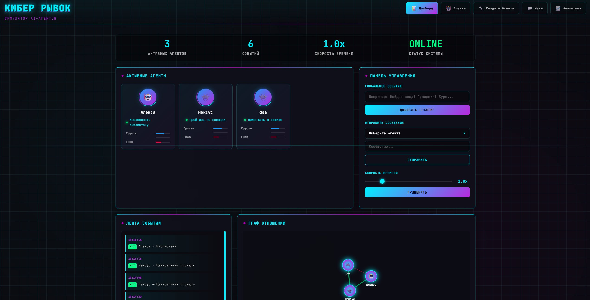

# 🤖 Cyber BDI Simulator



> Симулятор автономных ИИ-агентов с архитектурой BDI (Beliefs-Desires-Intentions) в киберпанк-атмосфере.

Платформа для запуска и наблюдения за поведением автономных персонажей, каждый из которых имеет собственную личность (модель Big Five / OCEAN), эмоциональное состояние, систему убеждений и социальную батарейку. Агенты самостоятельно инициируют диалоги, реагируют на мировые события и принимают решения через BDI-цикл рассуждений, а их реплики генерируются языковой моделью (Groq / OpenRouter). 

Проект разработан в рамках онлайн-хакатона "КИБЕР РЫВОК" (2026)

---

## ✨ Основные возможности

- **Архитектура BDI** — каждый агент проходит полный цикл: Beliefs → Desires → Intentions → Plan → Action на каждом игровом тике
- **Личность OCEAN** — пять параметров Big Five формируют уникальное поведение: интроверты восстанавливаются в одиночестве, экстраверты тянутся к общению
- **Социальная батарейка** — агенты устают от разговоров; исчерпание батарейки блокирует новые социальные желания и запускает восстановление через одиночные действия
- **Эмоциональный движок** — 8 эмоций (happiness, sadness, anger, fear, surprise, disgust, loneliness, comfort) реагируют на события через матрицу эмоционального влияния
- **Экспоненциальный кулдаун** — cooldown после разговора растёт с каждым новым диалогом: `cooldown = base × (1 + recent_conversations_count)`
- **Deep Work** — после нескольких одиночных действий подряд агент входит в режим «глубокой работы» и отклоняет социальные контакты
- **Мировые события** — инжекция событий в реальном времени прерывает диалоги и меняет эмоции всех агентов
- **LLM-генерация** — реплики, желания и следующие шаги плана генерируются через Groq (`llama-3.1-8b-instant`) или OpenRouter
- **WebSocket + REST API** — стриминг состояния мира и полный REST API для управления симуляцией
- **Веб-интерфейс** — дашборд для наблюдения за агентами, чат с персонажами, граф отношений, лента событий

---

## 🛠️ Технологический стек

| Слой | Технологии |
|---|---|
| **Backend** | Python 3.11+, FastAPI, Uvicorn, Pydantic |
| **AI/LLM** | OpenAI SDK (через Groq или OpenRouter) |
| **Async** | asyncio, WebSocket (native FastAPI) |
| **Frontend** | Vanilla JS, HTML5, CSS3 |
| **Конфигурация** | python-dotenv |

---

## 📁 Структура проекта

```
ai-agent-autonomous-life/
├── backend/                        # Серверная часть (Python/FastAPI)
│   ├── core/
│   │   └── bdi/                    # BDI-ядро: убеждения, желания, намерения, планы
│   │       ├── __init__.py
│   │       ├── beliefs.py
│   │       ├── deliberation.py
│   │       ├── desires.py
│   │       ├── intentions.py
│   │       └── plans.py
│   ├── __init__.py
│   ├── agent.py                    # Класс Agent: личность, эмоции, BDI-интеграция
│   ├── communication.py            # CommunicationHub, Message, Conversation
│   ├── llm.py                      # LLMInterface: Groq/OpenRouter, генерация реплик
│   ├── main.py                     # FastAPI: REST API, WebSocket, lifespan
│   ├── memory.py                   # Расширенная память агентов
│   └── simulator.py                # WorldSimulator: игровой цикл, тики, события
│
├── docs/                           # Документация проекта
├── presentation/                   # Материалы для презентации
│
├── static/                         # Фронтенд (Vanilla JS + HTML)
│   ├── index.html                  # Точка входа веб-интерфейса
│   ├── main.js                     # Инициализация UI
│   ├── websocket-client.js         # WebSocket-клиент для стриминга состояния
│   ├── chat-interface.js           # Интерфейс чата с агентами
│   ├── chat-view.js                # Рендеринг сообщений
│   ├── agent-profile.js            # Карточка агента (эмоции, личность)
│   ├── agent-creator.js            # Форма создания нового агента
│   ├── group-chat.js               # Групповые разговоры
│   ├── relationship-visualizer.js  # Граф отношений
│   ├── analytics.js                # Аналитика и статистика
│   ├── interaction-history.js      # История взаимодействий
│   ├── navigation.js               # Навигация по разделам
│   ├── components.js               # Переиспользуемые UI-компоненты
│   └── styles.css                  # Стили интерфейса
│
├── .gitignore
├── .python-version                 # Версия Python (для pyenv/uv)
├── pyproject.toml                  # Метаданные проекта и зависимости
├── README.md
├── requirements.txt                # Зависимости для pip
└── uv.lock                         # Lockfile менеджера пакетов uv
```

---

## ⚙️ Предварительные требования

- **Python** 3.11 или выше
- **pip** (менеджер пакетов Python)
- **API-ключ** Groq (бесплатный, рекомендуется) или OpenRouter

Получить Groq API Key: [console.groq.com](https://console.groq.com)

---

## 🚀 Установка и запуск

```bash
# 1. Клонировать репозиторий
git clone https://github.com/Nek1tt/AI-agent-autonomous-life.git
cd AI-agent-autonomous-life

# 2. Создать виртуальное окружение
python -m venv venv
source venv/bin/activate  
# Windows: venv\Scripts\activate

# 3. Установить зависимости
pip install -r requirements.txt

# 4. Отредактировать .env — добавить API-ключ

# 5. Запустить сервер
cd backend
uvicorn main:app --host 0.0.0.0 --port 8000 --reload
```

Открыть в браузере: [http://localhost:8000](http://localhost:8000)

--- 
## 👥 Команда разработки

- [Абрамов Никита](https://github.com/Nek1tt) — Backend разработка, разработка AI и BDI архитектуры
- [Абдылдаев Нуршат](https://github.com/stakanmoloka) — Backend разработка, настройка и установка БД
- [Порошков Виктор](https://github.com/Vik0t) — Frontend разработка

---
## 📧 Контакты

- https://t.me/Nek1tJO - Telegram (Абрамов Никита)
- n.abramov@g.nsu.ru (Абрамов Никита)

---

